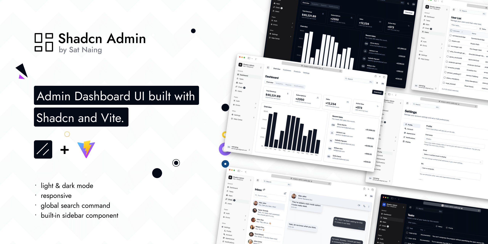

# Shadcn Admin Dashboard

Admin Dashboard UI crafted with Shadcn and Vite. Built with responsiveness and accessibility in mind.

> **Note**: This repository now includes a fully‑typed API client, state management powered by
> [Zustand](https://github.com/pmndrs/zustand), and a modular file structure designed for
> enterprise applications. Authentication and user management are implemented end‑to‑end using
> your own backend rather than third‑party providers.



I've been creating dashboard UIs at work and for my personal projects. I always wanted to make a reusable collection of dashboard UI for future projects; and here it is now. While I've created a few custom components, some of the code is directly adapted from ShadcnUI examples.

> This is not a starter project (template) though. I'll probably make one in the future.

## Features

- Light/dark mode
- Responsive
- Accessible
- With built-in Sidebar component
- Global Search Command
- 10+ pages
- Extra custom components

## Tech Stack

**UI:** [ShadcnUI](https://ui.shadcn.com) (TailwindCSS + RadixUI)

**Build Tool:** [Vite](https://vitejs.dev/)

**Routing:** [TanStack Router](https://tanstack.com/router/latest)

**Type Checking:** [TypeScript](https://www.typescriptlang.org/)

**Linting/Formatting:** [Eslint](https://eslint.org/) & [Prettier](https://prettier.io/)

**Icons:** [Tabler Icons](https://tabler.io/icons)

**Auth (partial):** [Clerk](https://go.clerk.com/GttUAaK)

## Run Locally

Clone the project

```bash
  git clone https://github.com/satnaing/shadcn-admin.git
```

Go to the project directory

```bash
  cd shadcn-admin
```

Install dependencies

```bash
  pnpm install
```

Start the server

```bash
  pnpm run dev

## Getting Started

1. **Install dependencies** using pnpm (or npm if you prefer):

   ```bash
   pnpm install
   ```

2. **Configure the API base URL** by creating a `.env` file at the project root and defining
   the `VITE_API_BASE_URL` variable. This value should point to the base of your backend API.

   ```env
   VITE_API_BASE_URL=https://localhost:8080/api/v1
   ```

3. **Start the development server**:

   ```bash
   pnpm run dev
   ```

4. Visit `http://localhost:5173/sign-in` in your browser and log in with valid credentials.
   Upon successful login you will be redirected to the authenticated dashboard. All protected
   pages live under the `/_authenticated` route and are guarded by the `useAuth` hook.

## Extending the API

All HTTP interactions are centralised in the [`ApiClient`](./src/api/ApiClient.ts). To
expose a new REST endpoint:

1. Add a new entry to [`ENDPOINTS`](./src/constants/endpoints.ts), e.g.:

   ```ts
   export const ENDPOINTS = {
     // existing keys…
     GET_PRODUCTS: 'getProducts',
   } as const;
   ```

2. Map the key to an actual path in [`apiConfig`](./src/config/api.ts):

   ```ts
   endpoints: {
     // existing mappings…
     [ENDPOINTS.GET_PRODUCTS]: '/products',
   },
   ```

3. Define the TypeScript types for the request/response in [`src/types`](./src/types).

4. Create a new store slice under [`src/store`](./src/store) or a custom hook under
   [`src/hooks`](./src/hooks) to fetch and manipulate the data. For example, see
   [`useUsers`](./src/hooks/useUsers.ts) for a simple pattern.

5. Finally, call the API from your React components using the `apiClient` instance or your
   newly defined hook/store.

### Example Usage

```ts
// Perform login from a React component
import { useAuth } from '@/hooks/useAuth'

function LoginButton() {
  const { login, status, error } = useAuth()
  const onSubmit = () => {
    login({ identifier: 'user@example.com', credential: 'password123' })
  }
  return (
    <button onClick={onSubmit} disabled={status === 'loading'}>
      Log In
    </button>
  )
}

// Fetch a list of users
import { useUsers } from '@/hooks/useUsers'

function UsersList() {
  const { users, status, fetchUsers } = useUsers()
  useEffect(() => {
    fetchUsers({ page: 1, limit: 20 })
  }, [fetchUsers])
  if (status === 'loading') return <div>Loading…</div>
  return (
    <ul>
      {users.map((u) => (
        <li key={u.id}>{u.email}</li>
      ))}
    </ul>
  )
}
```
```

## Sponsoring this project ❤️

If you find this project helpful or use this in your own work, consider [sponsoring me](https://github.com/sponsors/satnaing) to support development and maintenance. You can [buy me a coffee](https://buymeacoffee.com/satnaing) as well. Don’t worry, every penny helps. Thank you! 🙏

For questions or sponsorship inquiries, feel free to reach out at [contact@satnaing.dev](mailto:contact@satnaing.dev).

### Current Sponsor

- [Clerk](https://go.clerk.com/GttUAaK) - for backing the implementation of Clerk in this project

## Author

Crafted with 🤍 by [@satnaing](https://github.com/satnaing)

## License

Licensed under the [MIT License](https://choosealicense.com/licenses/mit/)
